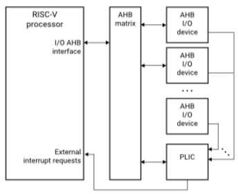
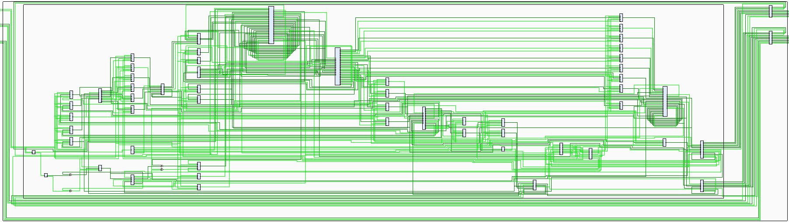

# RISCV32I Softcore Processor Emulated on an FPGA

## Introduction:
The proposed topic of research is to create a simulated RISC-V CPU using the “Boolean Board” FPGA from Xilinx. The CPU must be able to handle RISC-V instructions, as well as utilize the board interfaces like the on-board LEDs and switches. We will also be adding the capability to handle interrupts and IO interfaces for the UART port, buttons, etc. To this end, we will be implementing a bus interface and interrupt controller. The overall structure is outlined in the block diagram as shown in Figure 1.

*Figure 1. Hardware Block Diagram*

## CODAL to Verilog:
We are reusing a RISC-V processor implementation which we have written in CODAL for a Computer Organization class. We have used Codasip to convert this implementation into an RTL language called Verilog. The Verilog files will be implemented on an FPGA using the Vivado software from Xilinx. The processor schematic of the RISC-V processor as seen by Vivado is shown in Figure 2. We will also need to configure the constraint files so that the clock signal and other external ports are mapped appropiately.

*Figure 2. Vivado Generated Block Diagram of RISC-V Core*

## Memory Mapped I/O
One question we had regarded the mapping of cache and RAM for the RISC-V processor and the various I/O ports on the FPGA. After looking into datasheets, we assessed that it would be best to use a memory buffer to represent the instruction and data caches for the RISC-V processor. The other devices will interface with the RISC-V core by sending interrupts via the interrupt controller. Conversely, the RISC-V controller will interface with external IO devices using load and store operations addressed to memory mapped I/O. In other words, we will be mapping the registers of all peripherals to specific addresses in a memory map. This involves defining the address spaces for each peripheral and assigning unique addresses to their control and status registers. This will allow us to read and write to peripherals using memory addresses.

## AHB:
The AHB (Advanced High-performance Bus) is an interface between the processor and all of the peripherals, including the interrupt controller. It will handle address decoding, data transfer, and control signals for memory-mapped I/O. Among other peripherals, we will be connecting the UART port for serial communication. The AHB matrix will act as the communication hub for the RISC-V core, memory, interrupt controller, and the on-board I/O. We will be integrating a third party IP block of the AHB matrix & plan to modify it to interface with our processor, which is linked in our references page.

## Interrupt Controller:
The RISC-V Platform Level Interrupt Controller (PLIC) specification describes a standard implementation for an interrupt handling unit. The specification breaks down communication nodes into four categories: interrupt sources, gateways, the PLIC core, and the target (which will solely be the RISC-V core in this case). Handling of interrupts is broken down into six stages: (1) interrupt signal from the source; (2) interrupt request from the gateway; (3) interrupt notification from the PLIC; (4) interrupt claim from the target; (5) claim response from the PLIC; and (6) interrupt completion notification from the target. Since we only have a single interrupt target, we will be excluding the claim handling mechanisms (stages 4 and 5).  Every interrupt is associated with an interrupt ID, which is used to break ties based on priority and is then forwarded to the interrupt target (i.e the RISC-V core). The processor needs to be able to determine which interrupt handler to execute based on the interrupt ID. This will be handled using a trap vector table, which maps interrupt IDs to the hard-coded address of an interrupt handler. While an interrupt is triggered, the core will save the current PC counter of the last completed instruction, flush the pipeline, and start fetching instructions for the interrupt handler. Every interrupt handler must then include instructions restoring the previous PC counter. Since multiple interrupts can be chained with each other, the old PC cannot be stored in a single register, and must instead be stored in a FIFO structure.

## UART
In order to meet the needs of the application, peripherals are used to increase the processor's capacity to communicate with its external environment. A UART module is the first peripheral, which will be used for standard input and output in addition to a number of software features. UART is an asynchronous serial communication peripheral that uses two independent lines for data transmission (TX) and reception (RX). The most frequently used baud rates are 4800, 9600, 19200, 38400, 57600 and 112500 bps. Almost all microcontrollers support the UART protocol, which is used for low-distance and slow communication, such as connecting peripherals, debugging, and standard input/output communication.

## References
- [cracklescousin1234]. (2021, October 11). How to use FPGA memory in a CPU design? [Reddit Post]. https://www.reddit.com/r/FPGA/comments/q623f4/how_to_use_fpga_memory_in_a_cpu_design
- Ignacio, Anderson. [aignacio]. (2018, October 1). AMBA AHBv3 Lite Bus multi-slave / single master. https://github.com/aignacio/ahb_lite_bus 
- Mukhutdinov, Jameel. [psnjk]. (2018, November 7). Simple direct-mapped cache simulation on FPGA [Github]. https://github.com/psnjk/SimpleCache
- [rherveille]. (2017, April 24). AHB-Lite Timer. https://github.com/RoaLogic/ahb3lite_timer
- Real Digital. Boolean Board. https://www.realdigital.org/hardware/boolean 
- Real Digital. Boolean Board Complete Reference Manual. https://www.realdigital.org/doc/ 02013cd17602c8af749f00561f88ae21 
- RISC-V International. (2022, October). RISC-V Platform-Level Interrupt Controller Specification. (Version 1.0.0_rc5). Retrieved from: https://github.com/riscv/riscv-plic-spec/blob/master/ Riscv-plic-1.0.0_rc6.pdf
- Schmid, Thomas, Ye-Sheng Kuo, Matt Smith, Lohit Yerva, and Prabal Dutta. (2010). EECS 373 Lab 4: Interrupts. https://web.eecs.umich.edu/~prabal/teaching/eecs373-f11/labs/lab4/index.html 
- Schevade, Aditya. (2011, December 4). Simple Interrupt Controller. https://github.com/adibis/ Interrupt_Controller 

